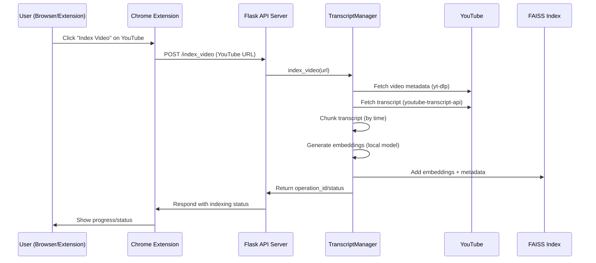
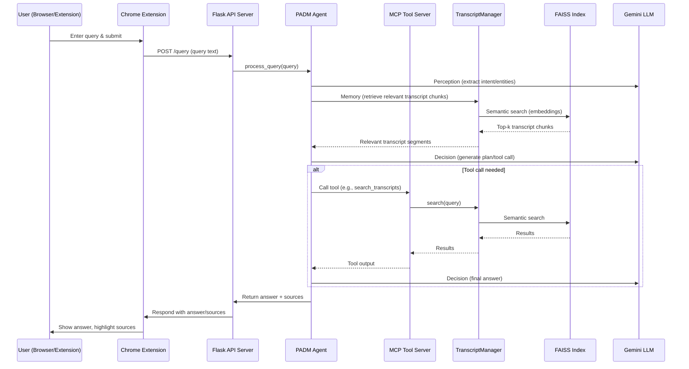

# 🎬 YouTube Transcript RAG Agent

**A full-stack, Retrieval-Augmented Generation (RAG) system for YouTube video transcripts, featuring a beautiful Chrome extension, blazing-fast semantic search with FAISS, and an intelligent agent powered by Google Gemini LLM.**

---

## 🌟 Features

- **Chrome Extension**: Index and query YouTube videos directly from your browser.
- **Semantic Search**: Instantly search across indexed video transcripts using vector embeddings and FAISS.
- **PADM Agent**: Modular Perception-Action-Decision-Memory agent architecture for intelligent, context-aware answers.
- **LLM Integration**: Uses Google Gemini for intent extraction, planning, and answer generation.
- **API Server**: Flask backend with endpoints for indexing, querying, and status.
- **Beautiful UI**: Modern, vibrant extension popup with smooth user experience.
- **Open Source**: Easily extensible and hackable.

---

## 🖼️ System Architecture

### 1️⃣ Indexing Flow



---

### 2️⃣ Query & PADM Agent Flow



---

## 🚀 Quickstart

### 1. Clone & Install

```bash
git clone https://github.com/yourusername/yt_rag.git
cd yt_rag
python -m venv venv
source venv/bin/activate  # or venv\Scripts\activate on Windows
pip install -r requirements.txt
```

### 2. Set Up Environment

- **Google Gemini API**: Get an API key and set `GEMINI_API_KEY` in a `.env` file.
- **Local Embedding Model**: Start a local embedding server (e.g., Ollama with `nomic-embed-text`).

Example `.env`:
```
GEMINI_API_KEY=your-gemini-key
```

### 3. Run the Backend

```bash
python agent.py
```

### 4. Load the Chrome Extension

- Go to `chrome://extensions`
- Enable "Developer mode"
- Click "Load unpacked" and select the `chrome_extension` folder

---

## 🧩 Project Structure

```
yt_rag/
│
├── agent.py                # Main Flask API & PADM agent
├── mcp_server.py           # MCP tool server for transcript search
├── models.py               # Pydantic models for data interchange
├── memory.py               # Memory component (retrieval)
├── perception.py           # Perception (intent/entity extraction)
├── decision.py             # Decision (planning, LLM)
├── action.py               # Action (tool execution, formatting)
├── utils/
│   ├── transcript_manager.py  # Transcript download, chunk, embed, index/search
│   └── status_tracker.py      # Indexing status tracking
├── data/
│   ├── transcripts/        # Raw transcript JSONs
│   └── faiss_index/        # FAISS index + metadata
├── chrome_extension/
│   ├── popup.html          # Extension UI
│   ├── js/                 # JS logic
│   ├── css/                # Styles
│   └── manifest.json       # Extension manifest
└── requirements.txt
```

---

## 🧠 PADM Agent: How It Works

- **Perception**: Extracts user intent and entities using Gemini LLM.
- **Memory**: Retrieves relevant transcript chunks (semantic search via FAISS).
- **Decision**: Plans next steps (tool call or answer) using Gemini LLM.
- **Action**: Executes tool calls (via MCP) or formats the final answer.

The agent loops through these steps, using retrieved transcript data and LLM reasoning, until a final answer is produced.

---

## 🖥️ Chrome Extension

- **Index**: One-click to index the current YouTube video.
- **Query**: Ask questions about any indexed video.
- **Results**: Answers are shown with direct transcript quotes and timestamps, plus clickable sources.

---

## 🛠️ API Endpoints

- `POST /index_video` — Index a new YouTube video.
- `GET /indexing_status/<operation_id>` — Check indexing progress.
- `POST /query` — Ask a question (RAG agent).
- `GET /list_indexed_videos` — List all indexed videos.

---

## 🧬 Dependencies

- `flask`, `flask-cors`
- `faiss-cpu`
- `pydantic`
- `requests`
- `google-generativeai`
- `youtube-transcript-api`, `yt-dlp`
- `mcp`
- `numpy`, `tqdm`

---

## 💡 Example Use Case

1. **Index**: On a YouTube video, click the extension and hit "Index Video".
2. **Query**: Ask, "Why are tech companies pulling job postings?"
3. **Result**: The agent returns a synthesized answer, quoting transcript segments and providing clickable sources.

---

## 🎨 Screenshots

> _Add screenshots of the extension popup, API responses, and example answers here!_

---

## 🤝 Contributing

PRs and issues welcome! See `CONTRIBUTING.md` (if you add one).

---

## 📄 License

MIT

---

**Enjoy your new YouTube RAG agent! 🚀**

---

Let me know if you want to further customize the README, add badges, or include more technical details! 